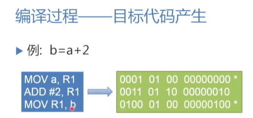

<meta name="referrer" content="no-referrer" />  

<!--more-->

[TOC]

# 编译原理

## Part 1 编译过程

对于一个高级语言程序,我们是如何将其转化为翻译成机器语言呢？

类比人翻译语言的过程（英语->中文）

1. 识别出句子中的单词
2. 分析句子的语法结构
3. 根据句子的含义初步翻译
4. 对译文进行修饰
5. 写出译文

编译程序同样拥有五个阶段：

1. 词法分析:输入源程序，扫描源程序字符串识别单词符号、根据其**构词规则**识别（哪些字符串为标识符，哪些为常量），通过**有限自动机**来描述构词规则。

   

2. 语法分析:根据**语法规则**把单词符号串分解成语法单位,下面就是Pascal语言赋值的语法规则。使用**上下文无关文法**来描述语法。

   

3. 中间代码产生:根据**语义规则**对各类语法单元按照语言的语义进行初步翻译。

   ```c
   int Z = X+0.618*Y;
   ```

   比如上面一个赋值语句,我们规定它是从右向左进行

   1)先计算赋值号右侧的结果

   2)将结果赋值给左侧变量

   通过**属性文法**来描述语义规则，生成中间代码(三元式,四元式)

   

4. 优化:对生成的中间代码进行加工变换，以期产生更高效的目标代码，遵循**程序的等价变换规则**

5. 目标代码产生：把中间代码换成特定机器上的目标代码。

   1）汇编指令代码

   2）绝对指令代码：包含绝对内存地址的机器码

   3）可重新定位指令代码：需要链接



## Part 2 编译程序结构

### 2.1 编译程序总框


### 2.2 遍 (pass)

遍，指的是对源程序或源程序的中间表示从头到尾扫描一次。

一遍可以由若干阶段组成（词法，语法，语义分析），一个阶段也可以分成若干遍来完成（优化段）

### 2.3 编译前端与后端


通过分成前后端，我们可以实现如下效果。

对于一个源程序，我们不改变编译前端，修改编译后端。举个例子，有一个c++程序，我们修改编译器，让其适配Windows，Linux，MaxOS，此时我们就可以更改编译后端达成目标。

同理，如果我们更改编译前端，后端不变，那就相当于书写不同语言的编译器。

那么编译前端就可以包括：词法，语法，语义分析器，中间代码生成器，以及部分与硬件无关的优化段

编译后端包括：与硬件优化相关的优化段和目标语言生成器

### 2.4 编译程序生成

1. 使用机器语言和汇编语言为工具开发（复杂且不好写）
2. 高级语言书写


 


##　Part 3 程序设计语言

### 3.1 程序设计语言的定义

程序本质上是一定字符集上的字符串

**语法**：一组规则，用它可以形成和产生一个**合式（well-formed）**程序

语法 = 词法规则+语法规则

词法规则：单词符号的形成规则。包括：

> 常数,标识符,关键字,运算符,等

使用有限自动机来表述词法规则

语法规则：语法单位的形成规则，包括：

> 表达式,语句,函数,等

使用上下文无关文法来描述语法规则。设语法单位为E，i为标识符,箭头代表定义为。那么我们可以如下定义语法：

```
E -> i
E -> E+E
E -> E*E
E -> (E)
```

词法和语法规则只定义程序的形式结构，比如上面的+,*它们不是加法和乘法，只是定义了这样定义语法是确定的。涉及到含义，那就属于**语义**的问题了。

根据语义规则，我们可以定义程序的意义。

例如：

```Python
a = 2**7
```

在Python中上述我们可以解释为：

计算2的7次方，将其赋值给a

这种解释是自然语言的描述，人能看懂，机器不行。所以我们使用形式描述来描述语义，如：

1. 操作语义
2. 指称语义
3. 代数语义


